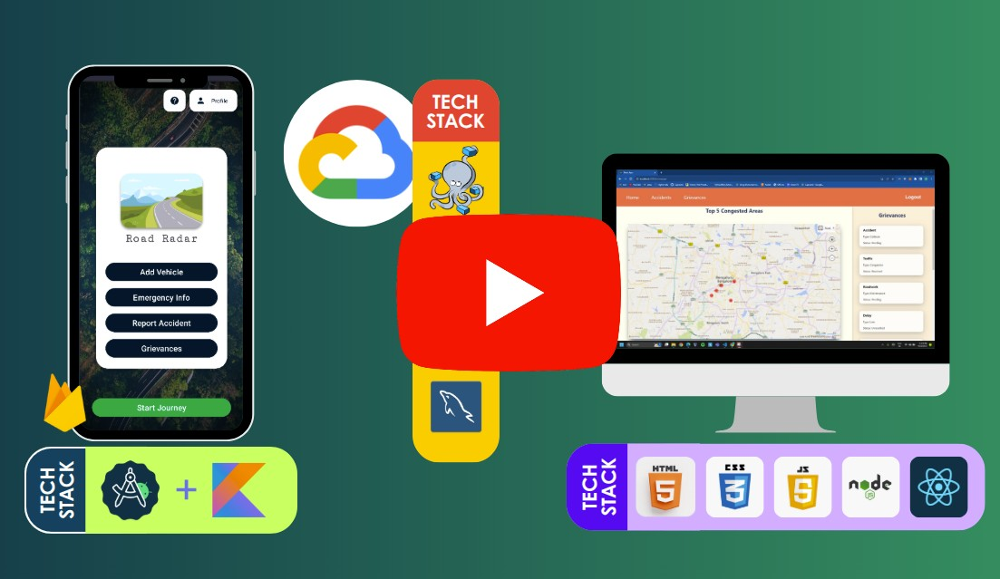

# Smart City Solutions for Traffic Management

Road Radar is a cloud-based traffic monitoring system built around anonymous, crowdsourced data from commuters. Users share real-time sensor data (GPS, accelerometer, gyroscope) through a mobile app; a cloud server processes it into traffic density reports that authorities view on a web dashboard. No central agency needed — the commuters on the road are the sensors.

This work was published as a [Scopus-indexed research paper in Springer](https://link.springer.com/chapter/10.1007/978-981-97-4540-1_8).

## [Video Demo & Product(s) Walkthrough](https://youtu.be/xEX3r39b6Z8)

> Watch on [YouTube](https://youtu.be/xEX3r39b6Z8)!

---

## High Level Design Diagram

## Low Level Design Diagrams

## Scope:
1. __Citizen-driven Intelligent Traffic Monitoring:__
 Building a futuristic citizen-driven system where the users willingly share information about their travel on the road.
2. __Collection & Analysis of Data:__
 Collection of data from mobile sensors – GPS position sensor (location), accelerometer (speed), G-sensor (crash detection), magnetism sensor (direction) and gyroscope (road inclination). This data will be used in analysis and representation of patterns for future traffic planning and management.
3. __Accident Alert:__
 This involves finding patterns of accidents, identifying accident prone areas (from historical data), and alerting users when they approach an accident prone area.
4. __Support for Reporting Accidents:__
 Added support to report accidents on the app, which will be sent to the respective authorities. The SOS feature will send the victim’s details (stored on the user’s device) to the concerned authorities, in case of a crash.
5. __Emergency Vehicle Alert:__
 Added support for emergency vehicles, by sending an alert to the authorities, to better prepare them in handling the situation.

## Novelty

- Our system is different from Google Maps with respect to:
  - _Anonymity_ of user data.
  - Alerts while approaching accident prone areas & for approaching emergency vehicles.
  - Historical view of traffic data for authorities.
  - Targeted support for emergency vehicles.

- As of now, there are NO apps that collect real-time traffic data from commuters and relay it directly to the authorities.

- SOS as a feature is not integrated in any other pre-existing service.

## Use Cases

1. **Real-time Traffic Management:**
   We can use real-time traffic data to optimize traffic flow, reduce congestion and improve safety on roads and highways.

2. **Intelligent Transportation Systems (ITS):**
   Intelligent transportation system is the application of sensing, analysis, control and communications technologies to ground transportation in order to improve safety, mobility and efficiency.

3. **Emergency Response:**
   Improving the efficiency of emergency response vehicles by providing real-time location updates to the concerned authorities and ensuring swift travel for emergency vehicles.

4. **Traffic Incident Management:**
   Reporting traffic incidents through our app to the concerned authorities, thereby reducing the impact on traffic flow and possibly saving lives using the SOS feature.

## Assumptions

- Our system is designed for a _scenario_, where all our cooperative users have smartphones.
- Most users on the road will use the app and have _GPS_ enabled.
- When the user registers, they will also be asked to _log the vehicles_ they own – type, model, registration no.
- The registration no. Will only be used in case of an emergency for identification and will **NOT be used to track them**.
- While starting a journey, they will _activate_ the app and also choose which of their vehicles they will be travelling in. They will also have an ‘other’ option in case they are not travelling in their own vehicle.

## Miscellaneous

- Emergency vehicles will have a dedicated view of the app.
- The authorities will be able to _track the emergency vehicles at all times_.
- In case of road blockages due to minor inconveniences, users will be able to _report_ this to the authorities responsible.

## Technologies/Domains

- Android App Development
- UI/UX Design
- IoT (Smartphone Sensors)
- Cloud operations
- Data analysis
